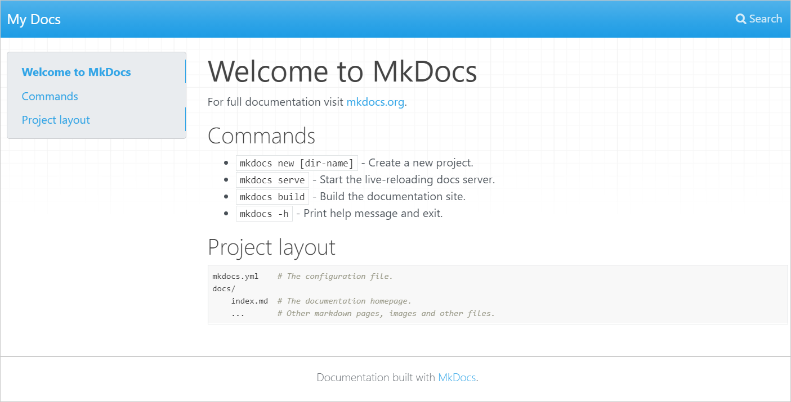
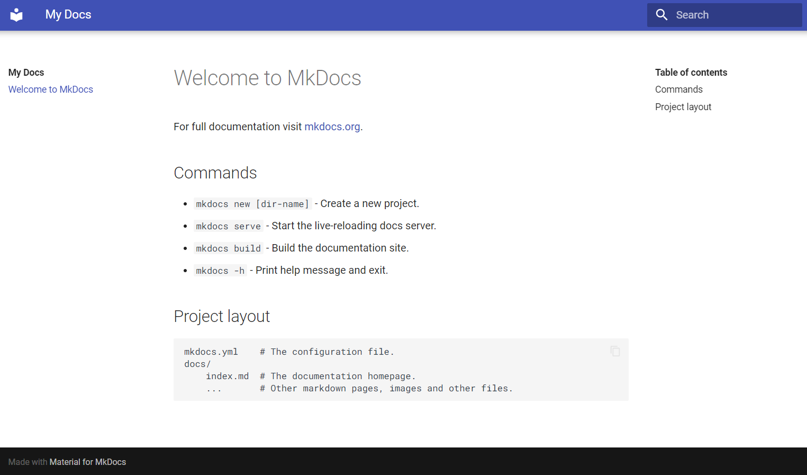

# 我们如何打造文档中心

Nebula Graph内容与文档团队使用[Mkdocs](https://www.Mkdocs.org/)和GitHub搭建文档中心。

TODO

<!--
## Mkdocs

MkDocs是一个快速、简单、美观的开源静态网站生成器，用于构建项目文档。文档源文件为Markdown格式，配置写在YAML文件中。

Mkdocs支持：

* 多主题，每种主题有不同的功能。
* 自定义功能。
* 预览网站。

## Material for MkDocs

Material for MkDocs是最流行的Mkdocs主题之一，支持通过Python、Docker、Git等方式安装。Nebula Graph文档中心有若干功能由该主题提供。

Material for MkDocs的安装和基础使用方式参考[Material官方文档](https://squidfunk.github.io/mkdocs-material/getting-started/#installation)。

> 说明：无需单独安装Mkdocs，Material会将其一起安装。

## 部署文档中心

我们使用[GitHub Pages](https://docs.github.com/en/pages/getting-started-with-github-pages)和[GitHub Actions](https://squidfunk.github.io/mkdocs-material/publishing-your-site/#with-github-actions)将GitHub文档库部署到文档中心，并实现修改文档后页面自动更新。

GitHub Pages默认使用的域名为{\<user> | \<organization>}.github.io，我们使用了[自定义域名](https://docs.github.com/en/pages/configuring-a-custom-domain-for-your-github-pages-site/about-custom-domains-and-github-pages)。

## 丰富文档中心功能

刚刚部署的文档中心仅有类似下图的默认的页面样式，我们需要挑选配置项和插件实现更多功能。



## 应用Material主题

在`mkdocs.yml`文件中加入以下配置：

```yml
theme:
  name: material
```

这样就应用了Material主题的基本样式：



### 更改页面颜色

Material for MkDocs提供了两类颜色主题，浅色背景的`default`和深色背景的`slate`。

编辑`mkdocs.yml`文件，加入`palette`字段：

```yml
theme:
  name: material
  palette:
    scheme: default
```

这时


-->
